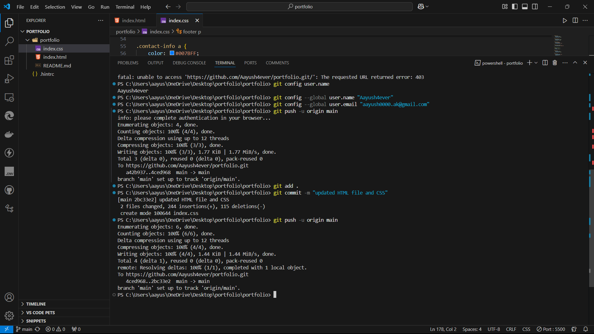
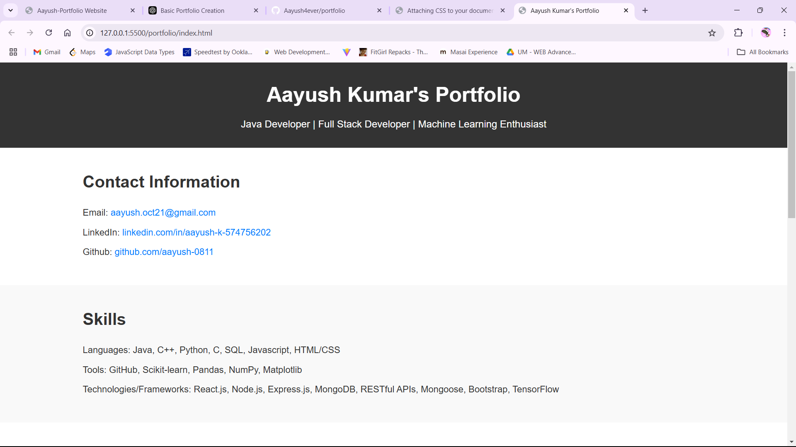
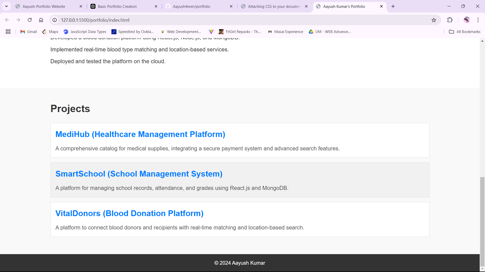

# Let's create a markdown file with the description and the uploaded screenshots.
md_content = """
# Pull Request for Assignment 2 Changes

### Title: "Updated HTML file and CSS for Portfolio Website"

### Description:
In this pull request, I have made the following changes to my portfolio website:
- Updated the HTML structure to improve the layout and added sections for contact information, skills, experience, and projects.
- Enhanced the CSS to make the layout more responsive, with improved font sizes, spacing, and section styling.
- Added interactive features like project links to GitHub repositories.
  
These changes aim to improve the usability and visual appeal of the portfolio website, ensuring a cleaner and more professional presentation.

### Screenshots:
1. The terminal where the changes were committed and pushed to GitHub:

2. The portfolio website rendered in the browser with contact information and skills section:

3. The portfolio website showcasing the projects section:

### Steps to Reproduce:
1. Clone the repository.
2. Run the HTML file locally to view the updated portfolio.
3. Review the changes in the Contact, Skills, Experience, and Projects sections.

### Next Steps:
- Review the changes and merge the pull request if everything looks good.
"""

# Write the markdown content to a new file
md_file_path = '/mnt/data/pull_request_description.md'

with open(md_file_path, 'w') as file:
    file.write(md_content)

md_file_path
